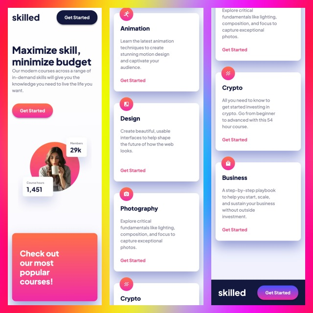
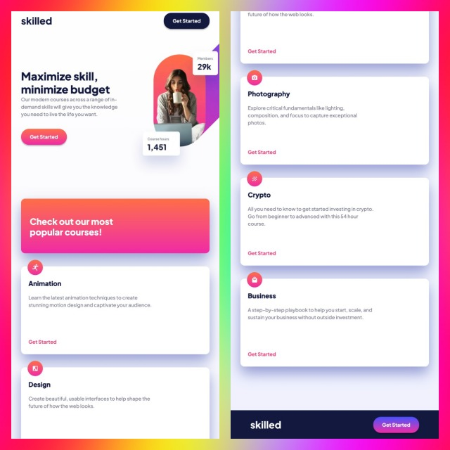

# Frontend Mentor - Skilled e-learning landing page solution

This is a solution to the [Skilled e-learning landing page challenge on Frontend Mentor](https://www.frontendmentor.io/challenges/skilled-elearning-landing-page-S1ObDrZ8q). Frontend Mentor challenges help you improve your coding skills by building realistic projects.

## Table of contents

- [Overview](#overview)
  - [The challenge](#the-challenge)
  - [Screenshot](#screenshot)
  - [Links](#links)
- [My process](#my-process)
  - [Built with](#built-with)
  - [What I learned](#what-i-learned)
  - [Continued development](#continued-development)
  - [Useful resources](#useful-resources)
- [Author](#author)
- [Acknowledgments](#acknowledgments)


## Overview

### The challenge

Users should be able to:

- View the optimal layout depending on their device's screen size
- See hover states for interactive elements

### Screenshot


#### Mobile View


#### Tablet View


#### Laptop View


### Links

- Solution URL: [Skilled E-Learning Solution]()
- Live Site URL: [Skilled E-Learning Live](https://tlanettepollard.github.io/Skilled-ELearning-Landing-Page-TLP/)

## My process

### Built with

- Semantic HTML5 markup
- SCSS for style
- Flexbox
- CSS Grid: Courses section layout
- Desktop-first workflow


### What I learned

After watching Practical Web Dev's tutorial, I decided to code from a different perspective. Instead of coding and styling with "mobile-first" in mind, I used his approach by styling "desktop-first". If there are few changes between the desktop and smaller breakpoints, then starting with desktop may be easier than starting with mobile. 
The tutorial was also helpful with placing the hero image. Initially I tried placing it as a background image and using **position: absolute** and **transform: translateX** to position the image. However, I had difficulty. That's when I found the tutorial and decided to insert the image in the index file. I used negative margins to position the image. 

I've included the code for the hero image: 

---

```html
<!-- Hero Images -->
            <div class="hero-desktop-img">
              
            </div>
            <div class="hero-tablet-img">
              
            </div>
            <div class="hero-mobile-img">
              
            </div>
```
```css
        .hero-desktop-img {
            margin-right: -33rem;
            margin-top: -15rem;

            @include bp-laptop {
                display: none;
            }

        }

        .hero-tablet-img {
            display: none;

            @include bp-laptop {
                display: block;
                margin-right: -17rem;
                margin-top: -6rem;
            }

            @include bp-xl-tablet {
                margin-right: -20rem;
            }

            @include bp-sm-tablet-one {
                display: none;
            }

        }

        .hero-mobile-img {
            display: none;

            @include bp-sm-tablet-one {
                display: block;
                margin-top: 2rem;
            }

            @include bp-sm-mobile {
                width: 100%;
            }
        }
```


### Continued development

I want to continue working with perfecting my skills with CSS and web page layouts.


### Useful resources

- [Skilled E-Learning Landing Page Full Project Tutorial](https://www.youtube.com/watch?v=Bpmyy2nX_Pg) - This tutorial by Practical Web Dev helped me when I had difficulty styling the Hero image. 
- [Stop Nesting Divs: Why Your Markup Is Making Layouts Harder ](https://javascript.plainenglish.io/stop-nesting-divs-why-your-markup-is-making-layouts-harder-c85b7f147029) - This is an article by Sanjeevani Bhandari about limiting the amount of **divs** you use in your HTML code.
- [Why translateX() instead of margin or position: absolute? ](https://javascript.plainenglish.io/why-translatex-instead-of-margin-or-position-absolute-d1403efd4e7d) - Sanjeevani Bhandari


## Author

- Website - [T. Lanette Pollard](https://trista-lanette-pollard-portfolio.vercel.app/)
- Frontend Mentor - [@tlanettepollard](https://www.frontendmentor.io/profile/tlanettepollard)
- Twitter - [@TpLanetteNBCT](https://x.com/TpLanetteNBCT)
- BlueSky - [@tristalanpollard](https://bsky.app/profile/tristalanpollard.bsky.social)


## Acknowledgments

[Practical Web Dev's](https://github.com/Practical-Web-Dev) tutorial was very helpful with the hero image placement. That was the one area where I was stuck during this project. 

